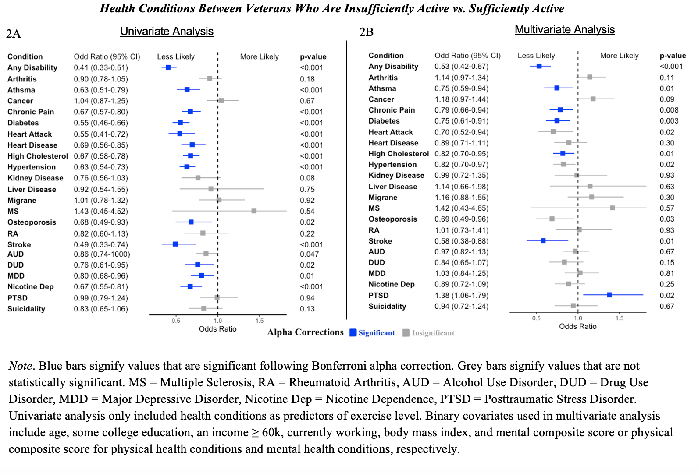

The following code will show you how I created my forrest plots for my thesis. This page includes:

1. Load in the data, seperate data into respective data frames for univariate and multivariate analysis.
2. Creating variables to to order the health conditions in the plot and indicate which health conditions are statistically significant. 
3. Create Forrest plots.
4. Create plot of health condition names and respective ORs and 95% CIs
5. Create plot of p values for respective health conditions.
6. Put together all of the plots
7. Report results of regressions

--- 
```{r, setup, message=FALSE}
## load up the packages we will need: 
library(tidyverse)
library(dplyr)
library(gt)
# for putting ggplots together
library(patchwork)
# for reordering facctors in ggplot
library(forcats)
library(kableExtra)

options(knitr.table.format = "html") 
```

# Import and Prep Data 
First thing to do is to load the data into R. I have already created tables 
with all of the values needed for these plots. 
```{r,message=FALSE}
#### Univariate regressions
Ins_Mod_Uni <- read_csv("~/Desktop/Coding/data/Ins_Mod_Uni.csv")
Ins_Act_Uni <- read_csv("~/Desktop/Coding/data/Ins_Act_Uni.csv")
Act_Mod_Uni <- read_csv("~/Desktop/Coding/data/Act_Mod_Uni.csv")

#### With Covariates
Ins_Mod <- read_csv("~/Desktop/Coding/data/Ins_Mod.csv")
Ins_Act <- read_csv("~/Desktop/Coding/data/Ins_Act.csv")
Act_Mod <- read_csv( "~/Desktop/Coding/data/Act_Mod.csv")
```

Example of data frame 
```{r}
knitr::kable(Ins_Mod[1:5,]) %>%
   kable_styling(bootstrap_options = c("striped", "hover", "condensed"))
```

Because `ggplot()` likes to sort things based upon its own "standards" we need to create 
a variable (i.e., order) and manually assign the order that we want the plot and 
values to be in. Additionally, I wanted to assign a variable that indicates which 
ORs were significant after alpha corrections, so I created a variable (i.e., sig) 
that we can use to color the significaant values later on. I used `mutate()` to create new variables and then manually assign the vlaues for each condition.

```{r}
#create the variable within the dataframe
Ins_Mod <- mutate(Ins_Mod, order = 0)
#update the values of the dataset to reflect the order we want
Ins_Mod[1,9]  = 2
Ins_Mod[2,9]  = 3
Ins_Mod[3,9]  = 4
Ins_Mod[4,9]  = 5
Ins_Mod[5,9]  = 6
Ins_Mod[6,9]  = 7
Ins_Mod[7,9]  = 8
Ins_Mod[8,9]  = 9
Ins_Mod[9,9]  = 10
Ins_Mod[10,9] = 11
Ins_Mod[11,9] = 12
Ins_Mod[12,9] = 13
Ins_Mod[13,9] = 14
Ins_Mod[14,9] = 15
Ins_Mod[15,9] = 16
Ins_Mod[16,9] = 17
Ins_Mod[17,9] = 18
Ins_Mod[18,9] = 19
Ins_Mod[19,9] = 20
Ins_Mod[20,9] = 21
Ins_Mod[21,9] = 22
Ins_Mod[22,9] = 23
Ins_Mod[23,9] = 24

Ins_Mod

# create a varaible for significance using alpha correction threshold 
Ins_Mod <- mutate(Ins_Mod, 
                  sig = ifelse(p.value < 0.016, 1, 0))
```

We are going to split these conditions into a mental and physical health dataframes.
because `ggplot()` gets mad when we try to arrange these all together. Here ou can see an example of the dataframe with the order and significance. 
```{r}
phc_IM <- Ins_Mod[1:17,]
mhc_IM <- Ins_Mod[18:23,]
knitr::kable(phc_IM) %>%
  kable_styling(bootstrap_options = c("striped", "hover"))
knitr::kable(mhc_IM) %>%
  kable_styling(bootstrap_options = c("striped", "hover"))
```
Now we have a data frame for physical health conditions and a data frame for mental 
health conditions. We will repeat these steps for the other 2 full models, and the 3 univariate models.

```{r, include=FALSE}
Ins_Act <- mutate(Ins_Act, order = 0)
Ins_Act[1,9]  = 2
Ins_Act[2,9]  = 3
Ins_Act[3,9]  = 4
Ins_Act[4,9]  = 5
Ins_Act[5,9]  = 6
Ins_Act[6,9]  = 7
Ins_Act[7,9]  = 8
Ins_Act[8,9]  = 9
Ins_Act[9,9]  = 10
Ins_Act[10,9] = 11
Ins_Act[11,9] = 12
Ins_Act[12,9] = 13
Ins_Act[13,9] = 14
Ins_Act[14,9] = 15
Ins_Act[15,9] = 16
Ins_Act[16,9] = 17
Ins_Act[17,9] = 18
Ins_Act[18,9] = 2
Ins_Act[19,9] = 3
Ins_Act[20,9] = 4
Ins_Act[21,9] = 5
Ins_Act[22,9] = 6
Ins_Act[23,9] = 7
Ins_Act

Ins_Act <- mutate(Ins_Act, 
                  sig = ifelse(p.value < 0.016, 1, 0))

phc_IA <- Ins_Act[1:17,]
mhc_IA <- Ins_Act[18:23,]

Ins_Act
```

```{r, include=FALSE}
Act_Mod <- mutate(Act_Mod, order = 0)
Act_Mod[1,9] = 2
Act_Mod[2,9] = 3
Act_Mod[3,9] = 4
Act_Mod[4,9]  = 5
Act_Mod[5,9]  = 6
Act_Mod[6,9]  = 7
Act_Mod[7,9]  = 8
Act_Mod[8,9]  = 9
Act_Mod[9,9]  = 10
Act_Mod[10,9] = 11
Act_Mod[11,9] = 12
Act_Mod[12,9] = 13
Act_Mod[13,9] = 14
Act_Mod[14,9] = 15
Act_Mod[15,9] = 16
Act_Mod[16,9] = 17
Act_Mod[17,9] = 18
Act_Mod[18,9] = 2
Act_Mod[19,9] = 3
Act_Mod[20,9] = 4
Act_Mod[21,9] = 5
Act_Mod[22,9] = 6
Act_Mod[23,9] = 7

Act_Mod <- mutate(Act_Mod, 
                  sig = ifelse(p.value < 0.016, 1, 0))


Act_Mod

phc_AM <- Act_Mod[1:17,]
mhc_AM <- Act_Mod[18:23,]
```

```{r,include=FALSE}
#### INS_MOD
#create the variable within the dataframe
Ins_Mod_Uni <- mutate(Ins_Mod_Uni, order = 0)
Ins_Mod_Uni <- cbind(Ins_Mod_Uni[,1:8],Ins_Mod_Uni[,10])
colnames(Ins_Mod_Uni)[9] = "order"
#update the values of the dataset to reflect the order we want
Ins_Mod_Uni[1,9]  = 2
Ins_Mod_Uni[2,9]  = 3
Ins_Mod_Uni[3,9]  = 4
Ins_Mod_Uni[4,9]  = 5
Ins_Mod_Uni[5,9]  = 6
Ins_Mod_Uni[6,9]  = 7
Ins_Mod_Uni[7,9]  = 8
Ins_Mod_Uni[8,9]  = 9
Ins_Mod_Uni[9,9]  = 10
Ins_Mod_Uni[10,9] = 11
Ins_Mod_Uni[11,9] = 12
Ins_Mod_Uni[12,9] = 13
Ins_Mod_Uni[13,9] = 14
Ins_Mod_Uni[14,9] = 15
Ins_Mod_Uni[15,9] = 16
Ins_Mod_Uni[16,9] = 17
Ins_Mod_Uni[17,9] = 18
Ins_Mod_Uni[18,9] = 19
Ins_Mod_Uni[19,9] = 20
Ins_Mod_Uni[20,9] = 21
Ins_Mod_Uni[21,9] = 22
Ins_Mod_Uni[22,9] = 23
Ins_Mod_Uni[23,9] = 24
# create a varaible for significance 
Ins_Mod_Uni <- mutate(Ins_Mod_Uni, 
                  sig = ifelse(p.value < 0.016, 1, 0))

phc_IM_Uni <- Ins_Mod_Uni[1:17,]
mhc_IM_Uni <- Ins_Mod_Uni[18:23,]

##### INS_ACT
#create the variable within the dataframe
Ins_Act_Uni <- mutate(Ins_Act_Uni, order = 0)
Ins_Act_Uni <- cbind(Ins_Act_Uni[,1:8],Ins_Act_Uni[,10])
colnames(Ins_Act_Uni)[9] = "order"
#update the values of the dataset to reflect the order we want
Ins_Act_Uni[1,9]  = 2
Ins_Act_Uni[2,9]  = 3
Ins_Act_Uni[3,9]  = 4
Ins_Act_Uni[4,9]  = 5
Ins_Act_Uni[5,9]  = 6
Ins_Act_Uni[6,9]  = 7
Ins_Act_Uni[7,9]  = 8
Ins_Act_Uni[8,9]  = 9
Ins_Act_Uni[9,9]  = 10
Ins_Act_Uni[10,9] = 11
Ins_Act_Uni[11,9] = 12
Ins_Act_Uni[12,9] = 13
Ins_Act_Uni[13,9] = 14
Ins_Act_Uni[14,9] = 15
Ins_Act_Uni[15,9] = 16
Ins_Act_Uni[16,9] = 17
Ins_Act_Uni[17,9] = 18
Ins_Act_Uni[18,9] = 19
Ins_Act_Uni[19,9] = 20
Ins_Act_Uni[20,9] = 21
Ins_Act_Uni[21,9] = 22
Ins_Act_Uni[22,9] = 23
Ins_Act_Uni[23,9] = 24
# create a varaible for significance 
Ins_Act_Uni <- mutate(Ins_Act_Uni, 
                  sig = ifelse(p.value < 0.016, 1, 0))

phc_IA_Uni <- Ins_Act_Uni[1:17,]
mhc_IA_Uni <- Ins_Act_Uni[18:23,]

#### Act_Mod
#create the variable within the dataframe
Act_Mod_Uni <- mutate(Act_Mod_Uni, order = 0)
Act_Mod_Uni <- cbind(Act_Mod_Uni[,1:8],Act_Mod_Uni[,10])
colnames(Act_Mod_Uni)[9] = "order"

#update the values of the dataset to reflect the order we want
Act_Mod_Uni[1,9]  = 2
Act_Mod_Uni[2,9]  = 3
Act_Mod_Uni[3,9]  = 4
Act_Mod_Uni[4,9]  = 5
Act_Mod_Uni[5,9]  = 6
Act_Mod_Uni[6,9]  = 7
Act_Mod_Uni[7,9]  = 8
Act_Mod_Uni[8,9]  = 9
Act_Mod_Uni[9,9]  = 10
Act_Mod_Uni[10,9] = 11
Act_Mod_Uni[11,9] = 12
Act_Mod_Uni[12,9] = 13
Act_Mod_Uni[13,9] = 14
Act_Mod_Uni[14,9] = 15
Act_Mod_Uni[15,9] = 16
Act_Mod_Uni[16,9] = 17
Act_Mod_Uni[17,9] = 18
Act_Mod_Uni[18,9] = 19
Act_Mod_Uni[19,9] = 20
Act_Mod_Uni[20,9] = 21
Act_Mod_Uni[21,9] = 22
Act_Mod_Uni[22,9] = 23
Act_Mod_Uni[23,9] = 24
# create a varaible for significance 
Act_Mod_Uni <- mutate(Act_Mod_Uni, 
                  sig = ifelse(p.value < 0.016, 1, 0))

phc_AM_Uni <- Act_Mod_Uni[1:17,]
mhc_AM_Uni <- Act_Mod_Uni[18:23,]
```


# Middle: Create The Plot

Now that we have the data all ready, we can create the plot. I am creating a function below called `mid_Fplot()` that will allow me to make the 6 forrest plots by calling the function instead of manually making every one. We create Forrest plots 
using `ggplot()` and using `geom_point() + geom_linerange()`. I waanted to signify 
which values were statistically significant after alpha corrections, so I used `color =` & `scale_color_manual()` to make the significant ones blue. For the forrest plot I am going to save the output of the plot into "phc_IA_mid". 

### Forrest Plot Function

```{r}
mid_Fplot <-function(data){
output <- data |>
  #Plot the value variable (in descending order) assigning significance to the 
  #values significant after Bon foroni alpha corrections
  ggplot(aes(y = reorder(variable, -order),color = as.factor(sig))) +
  #take away background
  theme_classic() +
  #make the forrest plot
  geom_point(aes(x=estimate), shape=15, size=3,show.legend = FALSE) +
  geom_linerange(aes(xmin=conf.low, xmax=conf.high),show.legend = FALSE) +
  #add color 
  scale_color_manual(values = c("#A6A6A6","blue"))+
  #change Cordinates
  labs(x="Odds Ratio") +
  #adjust the dimentions. 
  coord_cartesian(ylim = c(1,18), xlim=c(.25, 1.75)) +
  #add a line at 0 for reference 
  geom_vline(xintercept = 1, linetype="dashed") +
  #add anotations to help suggests what each side means.
  annotate("text", x = .5, y = 18, label = "Less Likely") +
  annotate("text", x = 1.5, y = 18, label = "More Likely") +
  #Git rid of the Y - Axis
  theme(axis.line.y = element_blank(),
        axis.ticks.y= element_blank(),
        axis.text.y= element_blank(),
        axis.title.y= element_blank())
return (output)
}
```


### Applying the function
As we separated the datasets into mental health and physical health data frames, we can just call one function to do both parts of the plots.
```{r}
#Physical Health Conditions Insufficient vs active
phc_IA_mid<-mid_Fplot(phc_IA)
#Mental Health Conditions Insffucient vs active
mhc_IA_mid<- mid_Fplot(mhc_IA)
```

No repeat this for the other 10 plots.
```{r}
# Insufficient vs Moderate Multi
phc_IM_mid <- mid_Fplot(phc_IM)
mhc_IM_mid <- mid_Fplot(mhc_IM)
# Active vs Moderate Muli
phc_AM_mid <- mid_Fplot(phc_AM)
mhc_AM_mid <- mid_Fplot(mhc_AM)

##### Univariate 

phc_IA_Uni_mid<-mid_Fplot(phc_IA_Uni)
mhc_IA_Uni_mid<- mid_Fplot(mhc_IA_Uni)
phc_IM_Uni_mid <- mid_Fplot(phc_IM_Uni)
mhc_IM_Uni_mid <- mid_Fplot(mhc_IM_Uni)
phc_AM_Uni_mid <- mid_Fplot(phc_AM_Uni)
mhc_AM_Uni_mid <- mid_Fplot(mhc_AM_Uni)
```

We have our plots! We can interpret this as, "Compared to veterans who were are insufficient active, veterans who were moderately active were (less/no difference/more) likely to report X health condition." For these figures the blue lines indicate which health conditions are significant after alpha corrections. 

```{r}
ggpubr::ggarrange(phc_IA_mid,mhc_IA_mid, ncol =2, nrow =1)
```

We have physical health on the left side and mental conditions on the right. You may be asking yourself, Where is the Y axis? I removed the Y axis for both plots so I could manually add the variable names and the odds ratios in the next step. 

# Left Side: labels and ORs

We took away the standard y axis of GGplot because it is simplistic. Now we are 
now going to add a Y axis that includes the variable names (i.e., Health Conditions) and their respective ORs.

### Update data frame
The output from the statistical models (e.g., p values) is not rounded to clean 
numbers. The code below tidy's up our data and creates new values. Additionally
our table has seperate values for OR, and 95% CI. The code below creates a function called `DF_update()`
that combines these values into one variable so we can call it for the table.

```{r}
DF_update <- function(data){
#assign the input and output of the data
output <-data |>
  # round estimates and 95% CIs to 2 decimal places for journal specifications
  mutate(across(
    c(estimate, conf.low, conf.high),
    ~ str_pad(
      round(.x, 2),
      width = 4,
      pad = "0",
      side = "right"
    )
  ),
  # add an "-" between HR estimate confidence intervals
  estimate_lab = paste0(estimate, " (", conf.low, "-", conf.high, ")")) |>
  # round p-values to two decimal places, except in cases where p < .001
  mutate(p.value = case_when(
    p.value < .001 ~ "<0.001",
    round(p.value, 2) == .05 ~ as.character(round(p.value,3)),
    p.value < .01 ~ str_pad( # if less than .01, go one more decimal place
      as.character(round(p.value, 3)),
      width = 4,
      pad = "0",
      side = "right"
    ),
    TRUE ~ str_pad( # otherwise just round to 2 decimal places and pad string so that .2 reads as 0.20
      as.character(round(p.value, 2)),
      width = 4,
      pad = "0",
      side = "right"
    )
  )) |>
  # add a row of data that are actually column names which will be shown on the plot in the next step
  bind_rows(
    data.frame(
      variable = "Condition",
      estimate_lab = "Odd Ratio (95% CI)",
      conf.low = "",
      conf.high = "",
      p.value = "p-value"
    )
  ) |>
  mutate(model = fct_rev(fct_relevel(variable, "Condition")))
# have the funciton spit out the new data
return(output)
}
```

Now that we have made a function, lets see what it does.
```{r}
# Insufficient vs Active
phc_IA_plot <- DF_update(phc_IA)
  #double check to make sure it worked.
glimpse(phc_IA_plot$estimate_lab)
```


Now we can use `DF_update()` to update the rest of the data frames.
```{r}
mhc_IA_plot <- DF_update(mhc_IA)

# Insufficient vs moderate
phc_IM_plot <- DF_update(phc_IM)
mhc_IM_plot <- DF_update(mhc_IM)

# active vs moderate
phc_AM_plot <- DF_update(phc_AM)
mhc_AM_plot <- DF_update(mhc_AM)

### Univaraite 
phc_IA_Uni_plot <- DF_update(phc_IA_Uni)
mhc_IA_Uni_plot <- DF_update(mhc_IA_Uni)
phc_IM_Uni_plot <- DF_update(phc_IM_Uni)
mhc_IM_Uni_plot <- DF_update(mhc_IM_Uni)
phc_AM_Uni_plot <- DF_update(phc_AM_Uni)
mhc_AM_Uni_plot <- DF_update(mhc_AM_Uni)
```

### Plotting the left side

Now that we have the variables int he format for the plot, we can plot them! I create the function `left_FP()` that plots all of the variables 
on the same axis as the forrest plot above. This allows us to add the varaibles and the respective Odds Ratios / Confideince intervals. 
```{r}
left_FP <- function(plot_data,type){
  # For Physical health condition plots
  if(type == "PHC") {
    # add the top row
    plot_data<-mutate(plot_data, top_row = 0)
    plot_data[18,9] = 1
    plot_data <- arrange(plot_data,order)

    # plot the left side of the plot 
    output <- plot_data %>% 
      ggplot(aes(y = model)) +
      geom_text(aes(x = 0, label = variable), hjust = 0, fontface = "bold")+
      geom_text(
      aes(x = 1, label = estimate_lab),
      hjust = 0,
      fontface = ifelse(phc_IA_plot$estimate_lab == "Odds Ratio (95% CI)", "bold","plain")) +
      theme_void() +
      coord_cartesian(ylim = c(1,18), xlim = c(0, 4))
  }
  # For Mental health condition plots
  if(type == "MHC"){
    #arange the labels on top
      plot_data<-mutate(plot_data, top_row = 0)
      plot_data[7,9] = 1
      plot_data <- arrange(plot_data,order)

    # plot the left side of the plot 
      output <- plot_data %>% 
        ggplot(aes(y = model)) +
        geom_text(aes(x = 0, label = variable), hjust = 0, fontface = "bold")+
        geom_text(aes(x = 1, label = estimate_lab),
        hjust = 0,
        fontface = ifelse(mhc_IA_plot$estimate_lab == "Odds Ratio (95% CI)", "bold","plain")) +
        theme_void() +
        coord_cartesian(ylim = c(1,18), xlim = c(0, 4))
  }
  return(output)
}
```

Run `left_FP` for multivariate and univariate plots. 
```{r}
# Multivariate
phc_IA_left<-left_FP(phc_IA_plot,"PHC")
mhc_IA_left<-left_FP(mhc_IA_plot,"MHC")
phc_IM_left<-left_FP(phc_IM_plot,"PHC")
mhc_IM_left<-left_FP(mhc_IM_plot,"MHC")
phc_AM_left<-left_FP(phc_AM_plot,"PHC")
mhc_AM_left<-left_FP(mhc_AM_plot,"MHC")

# Univariate 
phc_IA_Uni_left<-left_FP(phc_IA_Uni_plot,"PHC")
mhc_IA_Uni_left<-left_FP(mhc_IA_Uni_plot,"MHC")
phc_IM_Uni_left<-left_FP(phc_IM_Uni_plot,"PHC")
mhc_IM_Uni_left<-left_FP(mhc_IM_Uni_plot,"MHC")
phc_AM_Uni_left<-left_FP(phc_AM_Uni_plot,"PHC")
mhc_AM_Uni_left<-left_FP(mhc_AM_Uni_plot,"MHC")
```

Now we have our labels. In our labels we have the name of our conditions and the OR + 95 CI.
```{r}
phc_IA_left 
mhc_IA_left
```

# Right: P values 

We now have the left side and the middle of the plot. The last thing we need is 
to show the P values on the right side of the table. We have already updated our 
data frame (above) so now we can just put them in the figure like how we did for 
the left side. I create the function `right_FP()` that plots all of the p values on the
same y axis as the two plot types above. 


```{r}
right_FP<-function(plot_data){
    output <- plot_data |>
      ggplot() +
        geom_text(aes(x = 0, y = model, label = p.value), hjust = 0,
        fontface = ifelse(plot_data$p.value == "p-value", "bold", "plain")) +
        theme_void() +
        coord_cartesian(ylim = c(1,18))
return(output)
}
```

run `left_FP()`
```{r}
#. Multivaraite
phc_IA_right <- right_FP(phc_IA_plot)
mhc_IA_right <- right_FP(mhc_IA_plot)
phc_IM_right <- right_FP(phc_IM_plot)
mhc_IM_right <- right_FP(mhc_IM_plot)
phc_AM_right <- right_FP(phc_AM_plot)
mhc_AM_right <- right_FP(mhc_AM_plot)

# Univaraite 
phc_IA_Uni_right <- right_FP(phc_IA_Uni_plot)
mhc_IA_Uni_right <- right_FP(mhc_IA_Uni_plot)
phc_IM_Uni_right <- right_FP(phc_IM_Uni_plot)
mhc_IM_Uni_right <- right_FP(mhc_IM_Uni_plot)
phc_AM_Uni_right <- right_FP(phc_AM_Uni_plot)
mhc_AM_Uni_right <- right_FP(mhc_AM_Uni_plot)
```

Example of the p value output
```{r}
ggpubr::ggarrange(phc_IA_right,mhc_IA_right, ncol =2, nrow =1)
```

## Putting It Together
We now have all of the pieces of the puzzle. Now we need to specify how much area
all of these individual parts will take up in the final output. Below we specify where
each of the individual plots starts and finishes. t = top, l = left, b = bottom, 
r = right. We assign these to a a vector (e.g.layout) for the plot. We are creating 
a data frame of coordinates for the 3 different plot types to be plotted at using `patchwork::area()`.

```{r}
layout <- c(
  patchwork::area(t = 0, l = 0, b = 30, r = 25),
  patchwork::area(t = 0, l = 14, b = 30, r = 25),
  patchwork::area(t = 0, l = 23, b = 30, r = 30) 
  )

```

# Final Plot Arrangement
Combine all of the parts together to get the final product! We used `plot_layout()` to combine all of the plots together using the area cordinates specified using `patchwork::area()`

Here is an example of what the physical health and mental health plots look like
## Likelihood of reporting health conditions for veterans with sufficient physical activity compared to insufficient activity.
```{r,message=FALSE,results='hide'}
# physical health conditions. - Ins vs Mod
phc_IA_left + phc_IA_mid + phc_IA_right + plot_layout(design = layout)
mhc_IA_left + mhc_IA_mid + mhc_IA_right + plot_layout(design = layout)
```

Repeat for the remaining plots

```{r,include=FALSE}
phc_IM_left + phc_IM_mid + phc_IM_right + plot_layout(design = layout)
mhc_IM_left + mhc_IM_mid + mhc_IM_right + plot_layout(design = layout)
phc_AM_left + phc_AM_mid + phc_AM_right + plot_layout(design = layout)
mhc_AM_left + mhc_AM_mid + mhc_AM_right + plot_layout(design = layout)
phc_IA_Uni_left + phc_IA_Uni_mid + phc_IA_Uni_right + plot_layout(design = layout)
mhc_IA_Uni_left + mhc_IA_Uni_mid + mhc_IA_Uni_right + plot_layout(design = layout)
phc_IM_Uni_left + phc_IM_Uni_mid + phc_IM_Uni_right + plot_layout(design = layout)
mhc_IM_Uni_left + mhc_IM_Uni_mid + mhc_IM_Uni_right + plot_layout(design = layout)
phc_AM_Uni_left + phc_AM_Uni_mid + phc_AM_Uni_right + plot_layout(design = layout)
mhc_AM_Uni_left + mhc_AM_Uni_mid + mhc_AM_Uni_right + plot_layout(design = layout)
```

I struggled to figure out how to combine these two figures together without `ggplot()` getting angery. So I used the forbidden **_Illustrator_** to tidy up everything and combine the univariate and multivariate plots. The final plots are below with explanations of their results.

# Results

## Comparing the likelihood of reporting physical activity level based upon also reporting a health condition. {.tabset}

The following forrest plots depict univariate (without covariates) and multivariate (ater controling for covariates) relations between health conditions and activity level. For all figures the left side is univariate analysis and the right is multivariate. Note how multivaraite plots have less significant health conditions compared to univariate plots.

### Insufficient vs Sufficiently Activity



_**2A:** Univariate._ 
Those with several health conditions are less likely to report sufficiently active physical activity compared to insfucciently physical activity.

_**2B:** Multivariate._
For less health conditions are there differences between physical activity level. 
Compared to veterans who are insufficiently active, those who are sufficiently
active are less likely to report any disability, asthma, chronic pain, diabetes, 
and hypertension. No other differences were observed between the odds of
reporting other conditions between insufficient and moderate activity. 

Compared to veterans who are insufficiently active, those who are sufficiently
active are more likely to report PTSD.

### Insufficient vs Moderate Activity

![Note. Blue bars signify values that are significant following Bonferroni alpha correction. Grey bars signify values that are not statistically significant. MS = Multiple Sclerosis, RA = Rheumatoid Arthritis, AUD = Alcohol Use Disorder, DUD = Drug Use Disorder, MDD = Major Depressive Disorder, Nicotine Dep = Nicotine Dependence, PTSD = Posttraumatic Stress Disorder. Univariate analysis only included health conditions as predictors of exercise level. Binary covariates used in multivariate analysis include age, some college education, an income ≥ 60k, currently working, body mass index, and mental composite score or physical composite score for physical health conditions and mental health conditions, respectively.](images/Ins_Mod_FP.png)


_**2C:** Univariate._ 
Compared to insufficiently active veterans, those who are moderately active are less
likely to report certain health condtions. However, there is not as many conditions 
that this is statistically significant for compared to sufficiently active indiviudals.

_**2D:** Multivariate._
Compared to veterans who are insufficiently active, those who are moderately
active are less likely to report any disability, asthma, chronic pain, diabetes, 
high cholesterol, and stroke. No other differences were observed between the odds of
reporting other conditions between insufficient and moderate activity.

Compared to veterans who are insufficiently active, those who are moderately
active are less likely to report nicotine dependence. No other differences were observed between the odds of reporting other conditions between insufficient and moderate activity.

### Sufficient vs Moderate Activity

![Note. Blue bars signify values that are significant following Bonferroni alpha correction. Grey bars signify values that are not statistically significant. MS = Multiple Sclerosis, RA = Rheumatoid Arthritis, AUD = Alcohol Use Disorder, DUD = Drug Use Disorder, MDD = Major Depressive Disorder, Nicotine Dep = Nicotine Dependence, PTSD = Posttraumatic Stress Disorder. Univariate analysis only included health conditions as predictors of exercise level. Binary covariates used in multivariate analysis include age, some college education, an income ≥ 60k, currently working, body mass index, and mental composite score or physical composite score for physical health conditions and mental health conditions, respectively.](images/Mod_Act_FP.png) 

_**2E:** Univariate._
For a few health coditions, veterans with those conditions were more likely to report moderate activity compared to sufficiently active.

_**2F:** Multivariate._
No other differences were observed between the odds of
reporting physical health conditions between insufficient and moderate activity.


```{r,include=FALSE}
png(file="IvA_phc.png",
width=700, height=450)
phc_IA_left + phc_IA_mid + phc_IA_right + plot_layout(design = layout)
dev.off()

png(file="IvA_mhc.png",
width=700, height=450)
mhc_IA_left + mhc_IA_mid + mhc_IA_right + plot_layout(design = layout)
dev.off()

png(file="IvM_phc.png",
width=700, height=450)
phc_IM_left + phc_IM_mid + phc_IM_right + plot_layout(design = layout)
dev.off()

png(file="IvM_mhc.png",
width=700, height=450)
mhc_IM_left + mhc_IM_mid + mhc_IM_right + plot_layout(design = layout)
dev.off()

png(file="AvM_phc.png",
width=700, height=450)
phc_AM_left + phc_AM_mid + phc_AM_right + plot_layout(design = layout)
dev.off()

png(file="AvM_mhc.png",
width=700, height=450)
mhc_AM_left + mhc_AM_mid + mhc_AM_right + plot_layout(design = layout)
dev.off()
```


